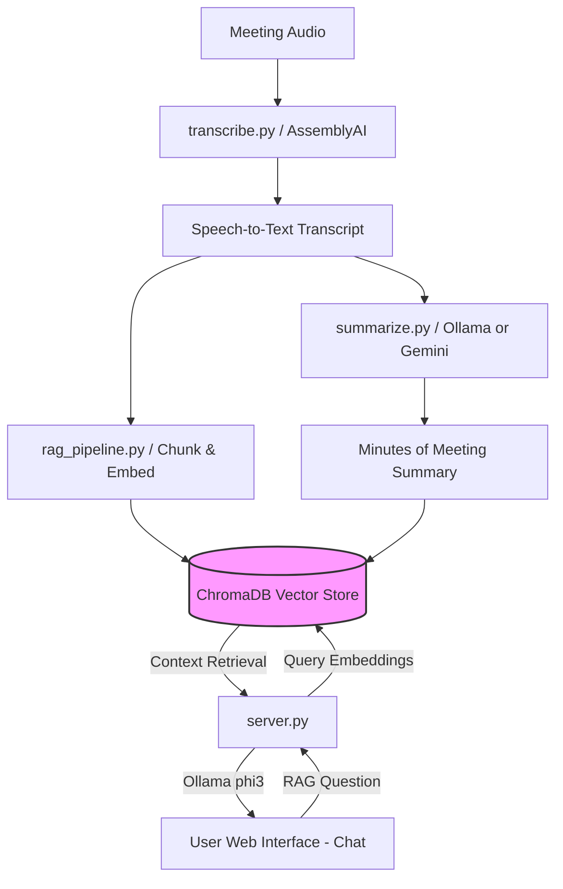

# Project Report: AI MOM Summarizer & Evaluation Suite
**Prepared by**: Antigravity (Senior AI Platform Engineer)  
**Target Audience**: Client / Project Stakeholders  
**Date**: July 7, 2026  

---

## 📖 Executive Summary

The **AI MOM (Minutes of Meeting) Summarizer & Evaluation Suite** is an end-to-end, enterprise-grade platform designed to automate the transcription, summarization, and interactive querying of corporate meetings. 

In addition to automated generation, the system features a rigorous **Evaluation Pipeline** designed to benchmark generated summaries and transcripts against human-annotated ground truths (using the industry-standard **MeetingBank** dataset). This ensures that any LLM prompt changes or model swaps can be evaluated with quantitative metrics (lexical overlap, semantic similarity, and factual consistency) rather than subjective reviews.

The platform is designed to run locally, prioritizing data privacy by running local Large Language Models via **Ollama**, while supporting cloud fallback pipelines (Google Gemini and AssemblyAI).

---

## 🏗️ System Architecture & Workflow

The platform consists of a backend orchestrating multiple pipelines, a modern single-page web application, and diagnostic command line interfaces.

---

## 🛠️ Feature Breakdown & Implementation

### 1. Speech-to-Text Transcription
*   **Module**: [transcribe.py](file:///home/Diwakar/Desktop/ai-mom-summarizer/transcribe.py)
*   **Core Engine**: Powered by **AssemblyAI's Universal-2** state-of-the-art speech recognition model.
*   **Speaker Diarization**: Automatically clusters voices and attributes dialog transcripts to structured entities (e.g., `Speaker A: [text]`, `Speaker B: [text]`).
*   **Reliability Logs**: Computes average word confidence scores and exports warning lists flagging low-confidence words (below 80%) to facilitate post-meeting editing.

### 2. Dynamic MoM Summarization
*   **Module**: [summarize.py](file:///home/Diwakar/Desktop/ai-mom-summarizer/summarize.py)
*   **Dynamic Prompt Routing**: Routes transcripts to tailored system prompts depending on meeting context. Supported templates include:
    *   `stand_up`: Focuses on daily tasks (Yesterday, Today, Blockers).
    *   `creative`: Focuses on idea brainstorming and attribution.
    *   `financial`: Standard corporate board layout focusing on resolution votes, approvals, and legal decisions.
    *   `sales_pitch`, `kickoff`, `post_mortem`, `one_on_one`, and `general` layouts.
*   **Strict Anti-Hallucination Grounding**: All prompts inherit a core system directive forcing models to anchor summaries strictly on the transcript. This prevents small, local models (e.g. `phi3`) from inventing numbers, names, or deadlines, adding `[unclear]` tags for phonetic STT ambiguities.

### 3. Inference with Multiple Models
Summarization and querying support both cloud-based and local host execution models:
*   **Local Inference**: Powered by local **Ollama** servers running:
    *   `phi3` (3.8B parameters) for general reasoning and summary extraction.
    *   `nomic-embed-text` for high-dimensional text embeddings.
*   **Cloud Inference**: Employs Google's **Gemini 2.5 Flash** (via API) for ultra-long transcripts, leveraging its high context windows and fast inference speeds.

### 4. Semantic Search & RAG (Retrieval-Augmented Generation) Pipeline
*   **Module**: [rag_pipeline.py](file:///home/Diwakar/Desktop/ai-mom-summarizer/rag_pipeline.py)
*   **Vector Database**: Employs **ChromaDB** as a persistent local vector database (`./meeting_db`).
*   **Ingestion Pipeline**: 
    1. Splits full transcripts into overlapping chunks of 400 words (50-word overlap) to maintain text context.
    2. Generates vector embeddings for each chunk and the core summary using the `nomic-embed-text` model.
    3. Stores vector indexes with metadata tags (e.g., `meeting_id`, `type: summary` vs `type: transcript_chunk`).
*   **Interactive Query Engine**: Queries the database using cosine similarity, extracts the top 3 relevant contexts, and builds an instruction-grounded prompt for the LLM to answer user questions about past meetings.
*   **CLI Interface**: [chat.py](file:///home/Diwakar/Desktop/ai-mom-summarizer/chat.py) offers a terminal chatbot supporting global or scoping queries on specific meeting IDs.

### 5. Web Application
*   **Backend**: Written in **FastAPI** ([server.py](file:///home/Diwakar/Desktop/ai-mom-summarizer/server.py)). It serves static assets, provides endpoints for file uploading and transcription, triggers the evaluation pipeline as synchronous subprocesses, and exposes the chat API.
*   **Frontend**: A premium single-page web app built with Vanilla HTML, CSS, and JS (located inside [static/](file:///home/Diwakar/Desktop/ai-mom-summarizer/static)). It includes:
    *   **Transcribe Dashboard**: Drag-and-drop audio uploader and structured transcription reviewer.
    *   **Meeting Brain**: Interactive chat interface to query database-stored meetings.
    *   **Evaluation Dashboard**: Interface to run evaluations on specific datasets and inspect detailed reports.

---

## 📈 Evaluation Metrics & Benchmark Suite

*   **Module**: [metrics.py](file:///home/Diwakar/Desktop/ai-mom-summarizer/metrics.py)
*   **Runner**: [evaluate_single_audio.py](file:///home/Diwakar/Desktop/ai-mom-summarizer/evaluate_single_audio.py)

The evaluation suite calculates 14 quantitative indicators comparing machine-generated files with human annotations:

| Metric Category | Specific Metrics | Technical Method |
| :--- | :--- | :--- |
| **Lexical Overlap** | ROUGE-1, ROUGE-2, ROUGE-L | N-gram overlap and Longest Common Subsequence (LCS). |
| | BLEU | Translation n-gram precision (using smoothing for short sentences). |
| | METEOR | Semantic overlap incorporating stemming, synonyms, and paraphrasing. |
| **Semantic Similarity**| BERTScore (P, R, F1) | Token-level contextual embeddings matching via RoBERTa. |
| | Embedding Cosine Similarity | Overall sentence-level similarity using `all-MiniLM-L6-v2`. |
| **Factual Consistency**| SummaC Score | Entailment classification checking if the summary is logically supported by the transcript using a pre-trained NLI model (`SummaCConv` with `"vitc"`). |
| | NLI Fallback | Zero-shot sequence classification (`facebook/bart-large-mnli`) calculating entailment score per sentence. |
| **Information Density**| Compression Ratio | Length of transcript divided by length of summary. |
| **Action Item Fidelity**| Action Item Precision, Recall, F1 | Extracts `{action, owner, deadline}` triples using LLM parsing, aligns candidate triples against references using Sentence Embedding Cosine Similarity (threshold $\geq 0.7$), and calculates classification metrics. |
| **ASR Quality** | WER, CER, Normalized WER | Word/Character Error Rates measuring transcription accuracy against ground truth using edit distance. |

---

## 🔍 How the Evaluation Pipeline Works

When the **Evaluation Pipeline** runs on a meeting clip:
1. It downloads the meeting metadata and reference annotations from the **MeetingBank** dataset.
2. It fetches and locally crops the raw audio file to segment boundaries using the `soundfile` library.
3. It performs transcription on the crop using AssemblyAI and records transcription metrics (WER/CER).
4. It prompts the candidate LLM (e.g., `phi3` or `gemini`) to generate the summary.
5. It runs the entire NLP metric suite, matching extracted action items and computing factual consistency.
6. It writes a structured JSON report and a human-readable Markdown evaluation report.

---

## 🔮 Conclusion & Next Steps
The project successfully establishes a solid foundation for enterprise audio summarization and automated model validation. 

**Recommended Future Work**:
*   **Pipeline Versioning**: Implement a diffing helper script (`diff_runs.py`) to automate A/B testing of prompt changes and calculate absolute metric changes ($\Delta$).
*   **Quantized LLM Testing**: Evaluate and compare smaller, faster quantized local models (such as Llama-3-8B or Qwen-2.5-7B) to benchmark performance differences against Gemini.
