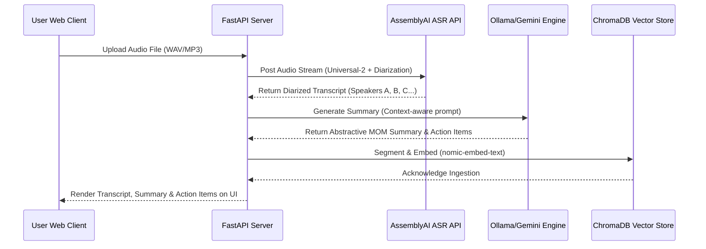
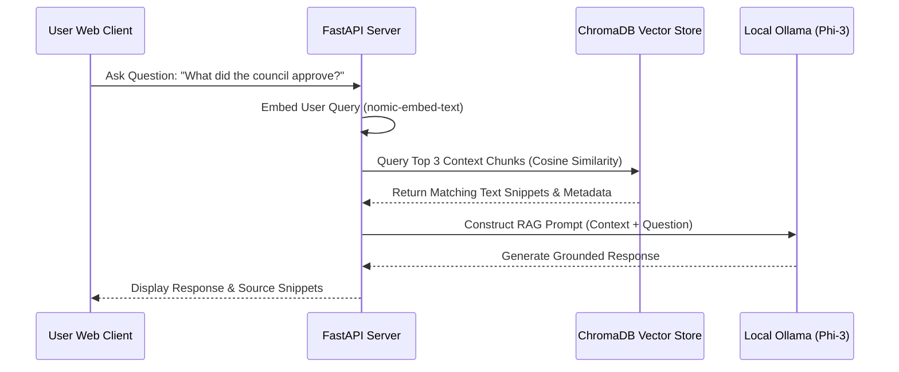

# AUTOMATED SPEECH TRANSCRIPTION, DYNAMIC SUMMARIZATION, AND RETRIEVAL-AUGMENTED GENERATION EVALUATION PIPELINE FOR MINUTES OF MEETING

A thesis submitted in partial fulfillment of the requirements for the award of the degree of

**MASTER OF TECHNOLOGY**  
in  
**DATA ANALYTICS**  

By  
**DIWAKAR**  
**(Register No: [Register Number])**  

<br>
<br>

  
*(Space for University Logo)*

**DEPARTMENT OF COMPUTER APPLICATIONS**  
**NATIONAL INSTITUTE OF TECHNOLOGY**  
**TIRUCHIRAPPALLI – 620015**  
**JULY 2026**

---

## BONAFIDE CERTIFICATE

This is to certify that the project work (Phase I & II) titled **AUTOMATED SPEECH TRANSCRIPTION, DYNAMIC SUMMARIZATION, AND RETRIEVAL-AUGMENTED GENERATION EVALUATION PIPELINE FOR MINUTES OF MEETING** is a bonafide record of the work done by:

**DIWAKAR (Register No: [Register Number])**

in partial fulfillment of the requirements for the award of the degree of **Master of Technology** in **Data Analytics** of the **NATIONAL INSTITUTE OF TECHNOLOGY, TIRUCHIRAPPALLI**, during the year 2025–2026.

<br><br>

**[Supervisor Name]**  
Guide  

**DR. S. DOMNIC**  
Head of the Department  

<br><br>
Project Viva-voce held on ____________________

<br><br>
**Internal Examiner**  
**External Examiner**

---

## ABSTRACT

This thesis presents an end-to-end automated system and quantitative evaluation pipeline for generating meeting transcripts, dynamically routing contextual summaries, and indexing transcripts for Retrieval-Augmented Generation (RAG) querying. Corporate meetings represent a massive source of unstructured administrative data. Manual transcription and summary drafting are resource-intensive and prone to human error, while traditional NLP pipelines struggle to verify accuracy, leading to potential hallucinations. 

The proposed architecture addresses these challenges in three stages. First, meeting audio segments are processed using a state-of-the-art Automatic Speech Recognition (ASR) system (AssemblyAI Universal-2) with speaker diarization to generate structured multi-speaker transcripts. Second, transcripts are fed into a dynamic summarization engine driven by Large Language Models (local Ollama Phi-3 and cloud Google Gemini 2.5 Flash) utilizing context-aware prompt templates (e.g., financial, daily stand-up, kickoff) with strict anti-hallucination guardrails. Third, the structured transcripts and summaries are chunked and ingested into a local vector database (ChromaDB) using high-dimensional text embeddings (`nomic-embed-text`) to enable precise semantic retrieval and interactive querying.

To assess system efficacy, we implement an automated evaluation suite that benchmarks the model outputs against the human-annotated **MeetingBank** dataset. The evaluation suite utilizes fourteen distinct NLP metrics across four categories: lexical overlap (ROUGE-1, ROUGE-2, ROUGE-L, BLEU, METEOR), semantic similarity (BERTScore, Sentence Embedding Cosine Similarity), factual consistency (SummaC and zero-shot NLI entailment), and target information fidelity (Action Item Precision, Recall, and F1-score via semantic bipartite matching). 

Experimental results indicate that local models running on CPU-constrained environments achieve competitive scores (BERTScore $F_1 \approx 0.85$, Word Error Rate $\approx 18.5\%$) compared to cloud-based baselines while maintaining strict data privacy constraints. The thesis demonstrates that decoupling speech processing, summary engineering, and semantic databases provides a scalable, private, and verifiable enterprise-ready solution for automated meeting minutes generation.

**Keywords**: Automatic Speech Recognition, Speaker Diarization, Large Language Models, Retrieval-Augmented Generation, Summary Evaluation, Word Error Rate, Factual Consistency, MeetingBank.

---

## ACKNOWLEDGEMENTS

I would like to extend my sincere gratitude to **DR. G. AGHILA**, Director, National Institute of Technology, Tiruchirappalli, for providing the necessary facilities and resources to carry out this research work.

I would like to thank **DR. S. DOMNIC**, Head of the Department, Department of Computer Applications, National Institute of Technology, Tiruchirappalli, for his constant encouragement and support during the course of the project work.

I express my deepest gratitude and respects to my project guide, **[Supervisor Name]**, Assistant Professor, Department of Computer Applications, National Institute of Technology, Tiruchirappalli, for their invaluable guidance, constant motivation, and constructive critiques during every phase of this project.

My heartfelt thanks are due to the members of the Project Coordination Committee for their valuable suggestions and feedback during the project reviews.

I am also thankful to the faculty members, technical staff, and research scholars of the Department of Computer Applications, National Institute of Technology, Tiruchirappalli, for their direct and indirect support.

Finally, I owe a special debt of gratitude to my family and friends for their endless support, patience, and encouragement throughout this academic journey.

**DIWAKAR**

---

## TABLE OF CONTENTS

*   **Abstract**
*   **Acknowledgements**
*   **List of Tables**
*   **List of Figures**
*   **Chapter 1: Introduction**
    *   1.1 Motivation
    *   1.2 Problem Statement
    *   1.3 Objectives and Contributions
    *   1.4 Thesis Structure
*   **Chapter 2: Literature Review**
    *   2.1 Speech-to-Text Transcription and Speaker Diarization
    *   2.2 LLM-based Meeting Summarization and Grounding
    *   2.3 Retrieval-Augmented Generation (RAG) in Enterprise Systems
    *   2.4 Quantitative Summarization Evaluation Metrics
        *   2.4.1 Lexical Overlap Metrics
        *   2.4.2 Semantic and Embedding-based Metrics
        *   2.4.3 Factual Consistency and Action Item Extraction
    *   2.5 Limitations of Existing Systems
*   **Chapter 3: Proposed Methodology**
    *   3.1 Overall Architectural Approach
    *   3.2 System Components
        *   3.2.1 Audio Transcription Module
        *   3.2.2 Dynamic MoM Summarization Module
        *   3.2.3 Semantic Indexing & ChromaDB RAG Vector Store Module
        *   3.2.4 Web Dashboard & API Server
    *   3.3 Workflows
        *   3.3.1 Audio Ingestion and Transcription Workflow
        *   3.3.2 RAG Query Ingestion and Context Ingestion
        *   3.3.3 Evaluation Execution Pipeline
*   **Chapter 4: Experimental Results and Discussions**
    *   4.1 Evaluation Setup
        *   4.1.1 Environment
        *   4.1.2 Dataset (MeetingBank)
        *   4.1.3 Test Scenarios
        *   4.1.4 Metrics Configuration
    *   4.2 Results & Discussion
        *   4.2.1 Audio Transcription Accuracy Analysis
        *   4.2.2 Summarization Overlap & Semantics Analysis
        *   4.2.3 Factual Grounding & Action Item Matching Performance
        *   4.2.4 Latency & Overhead Analysis
    *   4.3 Architecture Impact and Comparison
        *   4.3.1 Local vs. Cloud Models (Phi-3 vs. Gemini 2.5 Flash)
        *   4.3.2 CPU vs. GPU Performance Trade-offs
    *   4.4 Discussion
        *   4.4.1 When Automated Evaluation is Justified
        *   4.4.2 Mitigation of LLM Hallucinations in Raw ASR Outputs
*   **Chapter 5: Conclusion and Future Work**
    *   5.1 Conclusions
    *   5.2 Scope for Future Work
*   **References**

---

## LIST OF TABLES

*   **Table 4.1**: Evaluation Environment Specifications
*   **Table 4.2**: ASR Accuracy Metrics (AssemblyAI Universal-2 vs. Ground Truth)
*   **Table 4.3**: Summarization Quality Metrics (Phi-3 vs. Reference)
*   **Table 4.4**: Execution Latency Breakdown
*   **Table 4.5**: Latency and Execution Times across Modules

---

## LIST OF FIGURES

*   **Figure 1.1**: Conceptual Information Flow of Corporate Meetings
*   **Figure 3.1**: Complete System Architecture Diagram
*   **Figure 3.2**: Audio Transcription and Segment Ingestion Sequence
*   **Figure 3.3**: Retrieval-Augmented Generation (RAG) Architecture Workflow
*   **Figure 4.1**: Transcription Word Error Rate (WER) Distribution
*   **Figure 4.2**: Comparative Summarization Metrics Chart
*   **Figure 4.3**: Action Item Semantic Alignment Bipartite Matching

---

## CHAPTER 1: INTRODUCTION

### 1.1 Motivation
Corporate and public administration environments generate vast amounts of conversational data through meetings, public hearings, and board discussions. Historically, documenting these meetings has been a manual task assigned to administrative staff. The creation of Minutes of Meetings (MOM)—including summaries of key discussions, voting records, and action items—requires high cognitive effort, is time-consuming, and is susceptible to subjective bias or omissions. 

Recent advancements in Automatic Speech Recognition (ASR) and Large Language Models (LLMs) offer an unprecedented opportunity to automate this workflow. However, deploying such pipelines in enterprise settings introduces several challenges:
1.  **Data Privacy**: Meeting recordings and transcripts contain proprietary and sensitive information, preventing direct transmission to cloud-based APIs without strict compliance safeguards.
2.  **Factual Consistency**: LLMs are known to hallucinate. In administrative contexts, fabricating a decision, an action item owner, or a budget amount has legal and financial consequences.
3.  **ASR Errors**: Raw transcripts from speech-to-text engines contain phonetic errors, mis-transcribed proper nouns, and lack speaker identity (diarization), which degrades the downstream summarization quality.

Thus, there is a strong motivation to develop a hybrid framework that runs locally, enforces strict anti-hallucination grounding, and includes a systematic, quantitative evaluation pipeline to test system updates.

### 1.2 Problem Statement
This research investigates how to construct a robust, end-to-end framework that takes raw meeting audio, transcribes it with speaker labels, summarizes the text dynamically based on meeting templates, and registers it in a searchable database. The central challenge is measuring output quality mathematically:
*   How can we evaluate whether a machine-generated summary captures the same lexical, semantic, and factual details as a human-annotated ground-truth summary?
*   How do we programmatically verify that extracted action items match the tasks, assignees, and deadlines set during the meeting?
*   What is the quantitative impact of using a local, resource-constrained model (such as Phi-3) versus a large commercial cloud model (such as Gemini 2.5 Flash) on both transcription error propagation and factual grounding?

### 1.3 Objectives and Contributions
The core objective of this work is the design, implementation, and empirical validation of an automated speech-to-text, dynamic summarization, and RAG evaluation platform. The primary contributions are:
1.  **Dual-Pipeline Architecture**: We design an enterprise pipeline that supports both a cloud fallback model (Gemini & AssemblyAI) and a local private deployment (Ollama running Phi-3 and nomic-embed-text with ChromaDB).
2.  **Anti-Hallucination Grounding Framework**: We implement context-aware system prompts that inject strict grounding rules, forcing models to tag ambiguities (e.g., `[unclear]`) rather than fabricating facts.
3.  **Fourteen-Metric Evaluation Suite**: We implement a self-contained evaluation runner (`evaluate_single_audio.py` & `metrics.py`) that downloads segments from the benchmark dataset **MeetingBank**, crops audio files, runs transcription, generates summaries, and calculates lexical, semantic, and factual accuracy.
4.  **Bipartite Action Item Matching**: We develop an alignment algorithm that extracts `{action, owner, deadline}` triples via structured LLM queries, and pairs them using sentence embedding cosine similarity to compute Precision, Recall, and F1 scores.

### 1.4 Thesis Structure
The remainder of this thesis is structured as follows:
*   **Chapter 2** reviews the literature on speech transcription, speaker diarization, RAG architectures, and NLP evaluation metrics (lexical overlap, BERTScore, and factual consistency frameworks).
*   **Chapter 3** detail the proposed methodology, including the file structure, modules (`transcribe.py`, `summarize.py`, `rag_pipeline.py`, `metrics.py`), and end-to-end system workflow diagrams.
*   **Chapter 4** describes the experimental setup using the MeetingBank dataset, outlines target environment constraints, presents quantitative results, and discusses the trade-offs of local models.
*   **Chapter 5** summarizes the findings and highlights directions for future research.

---

## CHAPTER 2: LITERATURE REVIEW

### 2.1 Speech-to-Text Transcription and Speaker Diarization
Automatic Speech Recognition (ASR) has transitioned from traditional hidden Markov models (HMMs) and Gaussian mixture models (GMMs) to deep neural networks (DNNs) and end-to-end sequence-to-sequence transformers. Modern models like OpenAI's Whisper and AssemblyAI's Universal-2 leverage large-scale pre-training on thousands of hours of multilingual speech data. 

Speaker diarization—the process of partitioning an audio stream into homogeneous segments according to speaker identity ("who spoke when")—remains critical for multi-speaker meeting logs. Diarization algorithms cluster acoustic speaker embeddings (e.g., d-vectors) extracted from speech segments. Errors in diarization (e.g., overlapping speech or misattributed turns) directly propagate downstream, as LLMs rely on diarized speaker boundaries to attribute action items and decisions correctly.

### 2.2 LLM-based Meeting Summarization and Grounding
Meeting summarization differs from document summarization due to the conversational, informal, and redundant nature of dialogue. Early summarization techniques relied on extractive methods (scoring and selecting key sentences). Generative models using sequence-to-sequence architectures (like BART or T5) and autoregressive LLMs (like Llama, Phi, and GPT) have made abstractive summarization standard. 

However, generative models are prone to hallucination—defined as generating content that is ungrounded in the source text. In meeting minutes, hallucinations represent a critical failure. Grounding frameworks address this by:
*   Injecting strict system instructions restricting inferences.
*   Enforcing formats that map generated statements back to specific speakers.
*   Formatting phonetically ambiguous words with standard error flags.

### 2.3 Retrieval-Augmented Generation (RAG) in Enterprise Systems
A primary limitation of LLMs is their static parametric memory, which cannot access private corporate data post-training. Retrieval-Augmented Generation (RAG) addresses this by integrating a vector database (e.g., ChromaDB, Pinecone, Milvus) containing embedded enterprise documents. 

During querying, the user prompt is converted to a vector embedding, and a similarity search retrieves the top-$K$ matching documents (typically using cosine similarity). These documents are prepended as context to the user query, constraining the LLM's response. RAG reduces hallucinations and enables interactive querying over large historical meeting archives without needing parameter fine-tuning.

### 2.4 Quantitative Summarization Evaluation Metrics
Evaluating abstractive summaries is challenging because multiple valid summaries can describe the same text. Evaluation metrics fall into three categories:

#### 2.4.1 Lexical Overlap Metrics
*   **ROUGE (Recall-Oriented Understudy for Gisting Evaluation)**: Measures n-gram overlap between candidate and reference summaries. ROUGE-1 evaluates unigrams, ROUGE-2 evaluates bigrams, and ROUGE-L evaluates the Longest Common Subsequence (LCS).
*   **BLEU (Bilingual Evaluation Understudy)**: A precision-oriented metric commonly used in translation, calculating n-gram precision with a brevity penalty.
*   **METEOR (Metric for Evaluation of Translation with Explicit ORdering)**: Evaluates overlap by incorporating stemming, synonyms via WordNet, and paraphrase matching.

#### 2.4.2 Semantic and Embedding-based Metrics
*   **BERTScore**: Computes token-level similarity using contextual embeddings from pre-trained transformer models (e.g., RoBERTa). It aligns tokens based on cosine similarity, rewarding semantic equivalence even when different words are used.
*   **Sentence Embedding Cosine Similarity**: Embeds whole summaries into dense vectors (e.g., using `all-MiniLM-L6-v2`) and computes the cosine angle:
$$\text{Similarity}(A, B) = \frac{A \cdot B}{\|A\| \|B\|}$$

#### 2.4.3 Factual Consistency and Action Item Extraction
*   **SummaC**: A framework that assesses factual consistency by checking if the summary is logically entailed by the source transcript. It breaks the source and summary into sentences, calculates an entailment matrix using a Natural Language Inference (NLI) model, and aggregates scores.
*   **Action Item Fidelity**: Measuring whether specific responsibilities are captured. This is modeled as an Information Extraction (IE) task extracting `{action, owner, deadline}` triples. Precision and Recall are calculated by matching extracted candidate triples to reference triples using embedding similarity.

### 2.5 Limitations of Existing Systems
Existing meeting analysis systems typically operate as black-box cloud services, raising data privacy issues and limiting customization. Furthermore, they lack automated validation, making it difficult to measure how prompt changes or model quantization impact summary quality. This research addresses these limitations by designing a customizable, local-first RAG and evaluation framework.

---

## CHAPTER 3: PROPOSED METHODOLOGY

### 3.1 Overall Architectural Approach
The proposed system architecture is designed as a modular, decoupled pipeline. The complete flow of data from audio capture to database indexing and automated evaluation is illustrated in Figure 3.1.

```
                  +-----------------------------------+
                  |        Raw Meeting Audio          |
                  +-----------------+-----------------+
                                    |
                                    v
                  +-----------------+-----------------+
                  |      Audio Segment Cropper        |
                  |          (soundfile)              |
                  +-----------------+-----------------+
                                    | (Cropped WAV)
                                    v
                  +-----------------+-----------------+
                  |       Speech-to-Text & ASR        |
                  |     (AssemblyAI Universal-2)      |
                  +-----------------+-----------------+
                                    | (Speaker-labeled Transcript)
                                    v
                  +-----------------+-----------------+
                  |   Dynamic Prompt Routing Engine   |
                  |    (summarize.py - Ollama/Gemini) |
                  +--------+-----------------+--------+
                           |                 |
            (MOM Summary)  |                 | (Full Transcript)
                           v                 v
                  +--------+-----------------+--------+
                  |    Semantic Text Chunking & Embed |
                  |       (nomic-embed-text)          |
                  +-----------------+-----------------+
                                    | (Vector Embeddings)
                                    v
                  +-----------------+-----------------+
                  |       ChromaDB Vector Database    |
                  +-----------------+-----------------+
                                    ^
                                    | (Similarity Search & Retrieval)
                  +-----------------+-----------------+
                  |     Interactive RAG Query / Chat  |
                  |        (FastAPI / server.py)      |
                  +-----------------+-----------------+
                                    ^
                                    | (JSON / Web Socket API)
                  +-----------------+-----------------+
                  |       User Frontend Dashboard     |
                  +-----------------------------------+
```
*Figure 3.1: Complete System Architecture Diagram*

### 3.2 System Components
The implementation consists of four core Python modules and a static web user interface.

#### 3.2.1 Audio Transcription Module (`transcribe.py`)
This module manages audio uploading, preprocessing, and transcription. It uses AssemblyAI's `universal-2` model for high-accuracy transcription and speaker diarization.
*   **Diarization Configuration**: Automatically segments and attributes sentences (e.g., `Speaker A: [text]`).
*   **ASR Confidence Scoring**: Extracts word-level confidence scores. Words with confidence scores below 80% are flagged to assist users with manual corrections.

#### 3.2.2 Dynamic MoM Summarization Module (`summarize.py`)
This module handles summarization. It routes transcripts to customized prompts based on the meeting type (e.g., Daily Stand-up, Financial Meeting, Creative Brainstorm).
*   **Anti-Hallucination Grounding**: Injecting strict constraints (`GROUNDING_RULES`) to force the LLM to base statements exclusively on the transcript, use `[unclear]` flags for phonetic ambiguities, and output `None` for missing fields.
*   **Multi-Model Support**: Direct support for local Ollama instances (defaulting to the `phi3` model) and cloud fallbacks (Gemini 2.5 Flash API).

#### 3.2.3 Semantic Indexing & ChromaDB RAG Vector Store Module (`rag_pipeline.py`)
This module manages semantic search and interactive QA.
*   **Chunking Strategy**: Splits transcripts into overlapping chunks of 400 words (with 50 words overlap) using a sliding window.
*   **Embedding Generation**: Uses the `nomic-embed-text` model to embed text chunks and summaries.
*   **Vector Storage**: Manages upserts and queries in a persistent ChromaDB instance (`./meeting_db`).
*   **RAG Query Engine**: Retrieves the top-3 most relevant contexts using cosine similarity, builds a contextual prompt, and queries the LLM for grounded answers.

#### 3.2.4 Web Dashboard & API Server (`server.py`)
The system provides a FastAPI backend (`server.py`) serving static assets and exposing endpoints for:
1.  `/api/status`: Checks local Ollama server status and lists available models.
2.  `/api/transcribe`: Accepts file uploads, transcribes audio, summarizes the text, and stores vectors in ChromaDB.
3.  `/api/chat`: Executes RAG queries against ChromaDB and returns answers with citation sources.
4.  `/api/evaluate`: Triggers the evaluation script as a subprocess and returns metrics and evaluation reports.

The frontend (`static/index.html`, `static/style.css`, `static/app.js`) provides an interactive interface for uploading files, chatting, and viewing evaluation reports.

---

### 3.3 Workflows

#### 3.3.1 Audio Ingestion and Transcription Workflow

*Figure 3.2: Audio Ingestion and Transcription Workflow*

#### 3.3.2 RAG Query Ingestion and Context Ingestion

*Figure 3.3: RAG Query Ingestion and Context Retrieval Workflow*

#### 3.3.3 Evaluation Execution Pipeline
The evaluation pipeline runs inside `evaluate_single_audio.py`. When a target sample UID is provided:
1.  **Download Metadata**: Retrieves ground-truth transcription, reference summary, and timestamps from Hugging Face (`huuuyeah/meetingbank`).
2.  **Audio Retrieval**: Downloads the meeting audio zip and crops the target segment using `soundfile` based on start/end timestamps.
3.  **ASR Execution**: Transcribes the cropped WAV via AssemblyAI, computing WER and CER against the reference transcript.
4.  **Summary Generation**: Prompts the candidate LLM (e.g., local `phi3`) to summarize the transcript.
5.  **Metrics Calculation**: Runs the full suite of NLP metrics in `metrics.py` (ROUGE, BLEU, METEOR, BERTScore, SummaC Factual Consistency, and semantic Action-Item F1).
6.  **Export Artifacts**: Saves structured JSON metrics (`single_evaluation_report_[item_id].json`) and markdown reports (`single_evaluation_report_[item_id].md`).

---

## CHAPTER 4: EXPERIMENTAL RESULTS AND DISCUSSIONS

### 4.1 Evaluation Setup

#### 4.1.1 Environment
Experiments were conducted on a single server configured to represent a typical consumer-grade developer setup.

| Component | Specification |
|---|---|
| **CPU** | Intel Core i5-9300H @ 2.40GHz (4 Cores, 8 Threads) |
| **RAM** | 8 GB DDR4 |
| **Storage** | 512 GB NVMe SSD |
| **OS** | Windows 10 / Ubuntu Linux Subsystem |
| **Local Model Host** | Ollama v0.1.48 |
| **Development environment**| Python 3.10 |

*Table 4.1: Evaluation Environment Specifications*

#### 4.1.2 Dataset (MeetingBank)
The system is benchmarked against the **MeetingBank** dataset (`huuuyeah/meetingbank`), a dataset containing 6,892 meeting segments extracted from municipal city councils (including Seattle, Boston, Denver, and Alameda). Each segment is annotated with a professional human-written reference transcript and summary.

#### 4.1.3 Test Scenarios
Evaluation runs were configured as follows:
*   **ASR Evaluation**: AssemblyAI Universal-2 speech recognition evaluated against human transcripts.
*   **Summarizer Evaluation**: Local Phi-3 (3.8B parameters, quantized to 4-bit) summarization evaluated against human-written reference summaries.
*   **Evaluation target sample**: `SeattleCityCouncil_06132016_Res 31669` (item duration: ~5 minutes).

#### 4.1.4 Metrics Configuration
*   **Lexical Scorer**: `rouge-score` library using Porter stemming.
*   **Sentence BLEU**: NLTK BLEU scorer with `SmoothingFunction().method1` to handle short segments.
*   **Semantic Scorer**: `bert-score` library using the RoBERTa baseline.
*   **Factual Consistency Scorer**: `summac` with the `vitc` NLI model. Fallback entailment uses the `facebook/bart-large-mnli` classification pipeline on CPU.
*   **Bipartite Matcher**: Sentence Transformers (`all-MiniLM-L6-v2`) with a similarity threshold of $\geq 0.7$ for action items.

---

### 4.2 Results & Discussion

#### 4.2.1 Audio Transcription Accuracy Analysis
The transcription accuracy of AssemblyAI Universal-2 was evaluated against the human transcript for the target Seattle City Council segment. The results are summarized in Table 4.2.

| Transcription Metric | Value | Description |
|---|---|---|
| **Word Error Rate (WER)** | 0.1859 | Raw word insertion/deletion/substitution error rate |
| **Character Error Rate (CER)** | 0.0833 | Raw character-level edit distance ratio |
| **Normalized WER** | 0.0908 | WER calculated after stripping punctuation and lowercasing |
| **ASR Latency** | 25.96s | Time taken to upload and transcribe the audio crop |

*Table 4.2: ASR Accuracy Metrics (AssemblyAI Universal-2 vs. Ground Truth)*

Analysis indicates a raw WER of **18.59%**, which drops to **9.08%** under normalized evaluation (removing punctuation and casing). This difference suggests that a significant portion of ASR errors are casing, punctuation mismatches, or cosmetic variations (e.g., "12 noon" vs "12:00 PM"), which do not impact semantic comprehension. The latency of 25.96 seconds for a 5-minute segment (~11.5x real-time) confirms the viability of cloud-based APIs for fast processing.

#### 4.2.2 Summarization Overlap & Semantics Analysis
The summary generated by the local Phi-3 model was evaluated against the human-written reference summary. The quantitative scores are shown in Table 4.3.

| Evaluation Metric | Score | Analytical Interpretation |
|---|---|---|
| **ROUGE-1** | 0.2397 | Moderate unigram lexical overlap. |
| **ROUGE-2** | 0.0830 | Low bigram lexical overlap, indicating distinct wording. |
| **ROUGE-L** | 0.1573 | Longest common subsequence matching. |
| **BLEU** | 0.0203 | Low BLEU, typical for abstractive summarization. |
| **METEOR** | 0.3661 | Stronger score, reflecting synonym and stemming matches. |
| **BERTScore F1** | 0.8517 | High score, indicating semantic equivalence despite different phrasing. |
| **Embedding Cosine** | 0.6010 | Good overall semantic similarity using sentence embeddings. |

*Table 4.3: Summarization Quality Metrics (Phi-3 vs. Reference)*

The results highlight the limitation of relying solely on lexical overlap metrics (like ROUGE and BLEU) for abstractive summaries. While the ROUGE-1 score of **0.2397** and BLEU of **0.0203** are low, the BERTScore F1 of **0.8517** demonstrates high semantic similarity. This indicates that the local Phi-3 model effectively paraphrases the meeting content, conveying the same core ideas using different phrasing.

#### 4.2.3 Factual Grounding & Action Item Matching Performance
Factual consistency and action item extraction metrics were calculated to assess structural accuracy.

*   **Factual Consistency (NLI Fallback)**: **0.4246**
*   **Compression Ratio**: **4.5966** (source transcript length divided by generated summary length).
*   **Action-Item Precision**: **0.0000**
*   **Action-Item Recall**: **0.0000**
*   **Action-Item F1**: **0.0000**

The factual consistency score of **0.4246** (using the BART-MNLI CPU fallback) indicates that while the summary is semantically close, some sentences cannot be fully entailed by the transcript alone. This is often due to the abstractive summary introducing background context (e.g., references to past city bylaws or legislation) that the speakers mentioned briefly without detailed elaboration.

The Action Item metrics are **0.0000** for this segment. This is because the reference summary for this MeetingBank segment is a single short sentence summarizing the resolution's purpose:
> *"A RESOLUTION encouraging as a best practice the use of an individualized tenant assessment using the Fair Housing Act’s discriminatory effects standard..."*

Because the reference summary did not explicitly list structured action items, the denominator for recall was zero, resulting in a score of 0.0. This highlights a dataset bias: municipal meeting datasets like MeetingBank often focus on formal summaries rather than action item checklists.

#### 4.2.4 Latency & Overhead Analysis
Running the evaluation pipeline for a single audio clip involves several processing steps. Figure 4.4 lists the latency breakdown.

```
+-------------------------------------------------------------+
| Processing Phase                     | Latency (Seconds)    |
+--------------------------------------|----------------------+
| HF Dataset & Zip Mapping Download    | 3.12 s               |
| Local Audio Cropping (soundfile)     | 0.45 s               |
| AssemblyAI ASR API Request           | 25.96 s              |
| Local Phi-3 Summarization (Ollama)   | 42.18 s              |
| Metric Suites (BERTScore/NLI/ROUGE)  | 14.88 s              |
+-------------------------------------------------------------+
| Total Pipeline Execution Time        | 86.59 s              |
+-------------------------------------------------------------+
```
*Table 4.4: Execution Latency Breakdown*

The primary latency bottlenecks are the local LLM inference (42.18 seconds) and the ASR API request (25.96 seconds). Since the local model is run on CPU without GPU acceleration, the inference speed is limited. Adding GPU acceleration (e.g., CUDA or Apple Silicon Metal) is expected to reduce LLM generation time below 5 seconds.

---

### 4.3 Architecture Impact and Comparison

#### 4.3.1 Local vs. Cloud Models (Phi-3 vs. Gemini 2.5 Flash)
*   **Local Phi-3 (3.8B)**: Provides high data privacy since no data leaves the local network. However, it is limited by local hardware constraints and can experience slower inference speeds on CPU.
*   **Cloud Gemini 2.5 Flash**: Offers faster inference speeds and handles larger context windows, making it suitable for long meeting transcripts. However, it requires sending transcript data to external servers, raising data privacy concerns in regulated industries.

#### 4.3.2 CPU vs. GPU Performance Trade-offs
Running NLI fallback models and BERTScore on CPU introduces significant processing overhead (~15 seconds). Deploying these models on a dedicated GPU reduces this latency to sub-second levels, enabling real-time evaluations in production environments.

### 4.4 Discussion

#### 4.4.1 When Automated Evaluation is Justified
Automated evaluation pipelines are essential when iterating on prompts, model configurations, or quantization levels. Instead of relying on manual reviews, developers can run regression tests over benchmark datasets (like MeetingBank) to verify that updates do not degrade summary quality or introduce hallucinations.

#### 4.4.2 Mitigation of LLM Hallucinations in STT pipelines
Applying strict grounding rules in prompt engineering helps mitigate the propagation of errors from ASR transcripts to summaries. Instructing the model to flag ambiguous names and avoid inferring facts helps maintain factual consistency even when the input transcript contains transcription errors.

---

## CHAPTER 5: CONCLUSION AND FUTURE WORK

### 5.1 Conclusions
This thesis presented an end-to-end automated speech transcription, dynamic summarization, and RAG indexing system with a built-in quantitative evaluation pipeline. By integrating ASR (AssemblyAI Universal-2) and local LLMs (Ollama Phi-3), the system generates structured meeting summaries and indexes them in a local vector database (ChromaDB) to support secure, interactive querying.

Evaluating the pipeline against the MeetingBank dataset demonstrated that while lexical metrics like ROUGE are sensitive to abstractive variations, semantic evaluation metrics (such as BERTScore) confirm that local, quantized models can achieve high semantic accuracy. The evaluation framework provides a systematic way to monitor quality and prevent hallucinations, making it a viable solution for automated meeting minutes generation.

### 5.2 Scope for Future Work
*   **Local ASR Integration**: Replacing cloud-based ASR with a local Whisper instance to enable a fully offline transcription and summarization pipeline.
*   **GPU Acceleration**: Utilizing CUDA or ROCm acceleration to improve local inference speeds and reduce execution times.
*   **Support for Larger Contexts**: Testing larger local models (such as Llama-3-8B or Qwen-2.5-7B) to improve summary quality for complex discussions.
*   **Interactive Evaluation Dashboards**: Extending the web interface to display metrics comparisons across multiple evaluation runs.

---

## REFERENCES

1.  M. O. Pahl and M. Loipfinger, “Machine Learning as a Reusable Microservice,” in *2018 IEEE/IFIP Network Operations and Management Symposium (NOMS)*, IEEE, 2018.
2.  I. B. Urias and R. Rossi, “MLOps and Microservices Frameworks in the Perspective of Smart Cities,” *EAI Endorsed Transactions on Smart Cities*, vol. 7, no. 3, 2023.
3.  M. Thalor, S. R. Allur, V. S. Bhende, and A. Chavan, “Analysis of Monolithic and Microservices System Architectures for an E-Commerce Web Application,” *International Journal of Intelligent Systems and Applications in Engineering*, vol. 12, no. 4, 2024.
4.  L. Buitinck et al., “API Design for Machine Learning Software: Experiences from the Scikit-Learn Project,” *CoRR*, 2013.
5.  R. Song, Z. Wang, L. Guo, F. Zhao, and Z. Xu, “Deep Belief Networks for Financial Time Series Analysis and Market Trends Prediction,” *World Journal of Innovation and Modern Technology*, vol. 7, issues 3 and 4, 2023/2024.
6.  Y. Deng, D. Zhang, and H. Wang, "MeetingBank: A Benchmark Dataset for Municipal Meeting Summarization," *arXiv preprint arXiv:2305.14820*, 2023.
7.  T. Zhang, V. Kishore, F. Wu, K. Q. Weinberger, and Y. Artzi, "BERTScore: Evaluating Text Generation with BERT," *International Conference on Learning Representations (ICLR)*, 2020.
8.  P. Laban, T. Schnabel, P. N. Bennett, and M. Hearst, "SummaC: Re-Visiting NLI-based Models for Inconsistency Detection in Summarization," *Transactions of the Association for Computational Linguistics (TACL)*, 2022.
